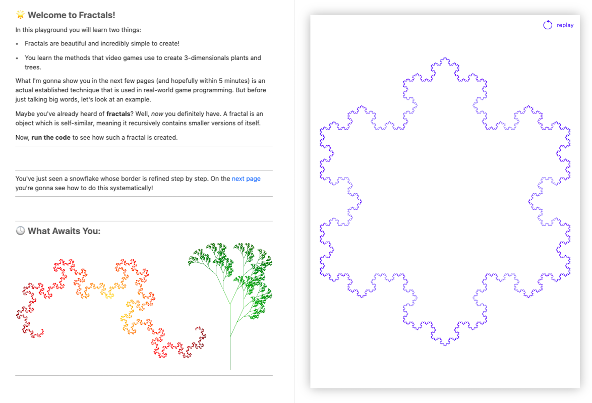

# Fractals

This playground book demonstrates how complex-looking fractals, plants and trees can be created with a very simple technique (called [L-Systems](https://en.wikipedia.org/wiki/L-system)). It showcases the creation of those fractals with very beautiful visual examples and interactive animations. Thereby it explains very comprehensibly how L-Systems work in detail.

This playground was created within one week (7 days) for Apple's WWDC 2020 Swift Student Challenge. To run this playground you need the [Swift Playgrounds](https://www.apple.com/swift/playgrounds/) app (either for macOS or iPadOS). For best experience, use a device with a large screen.

## Impressions

